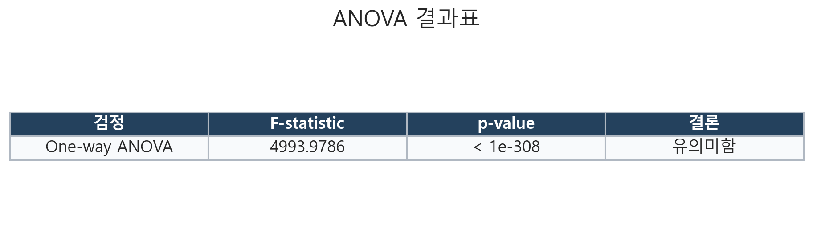
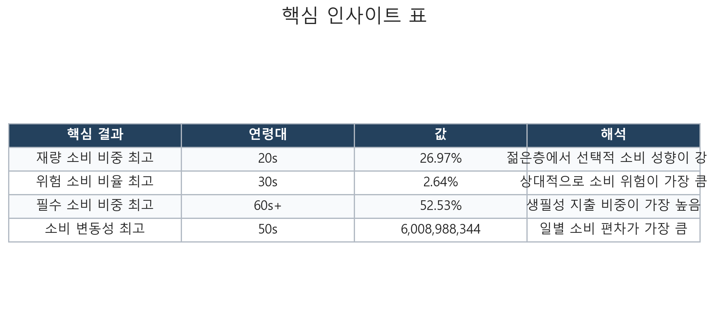
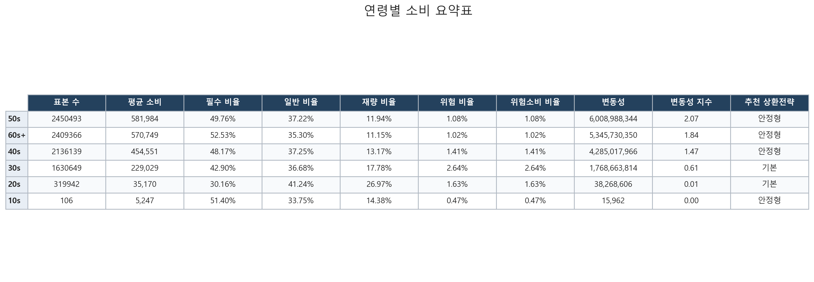
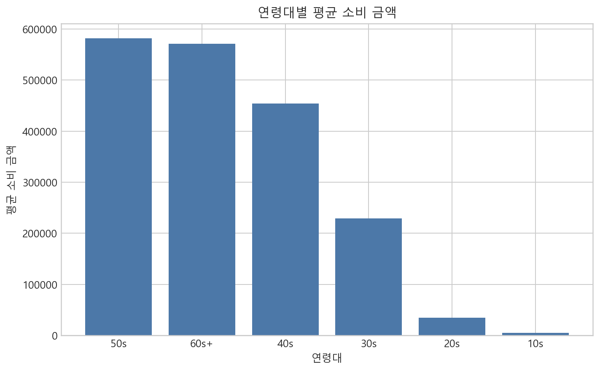
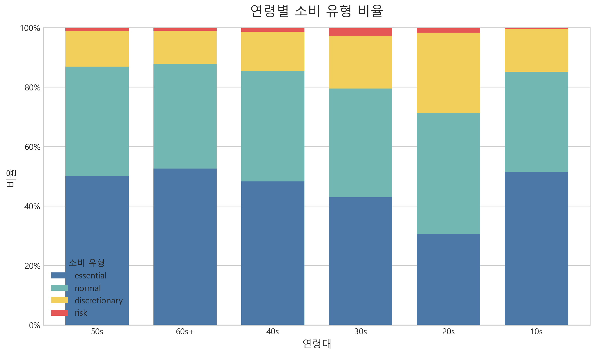
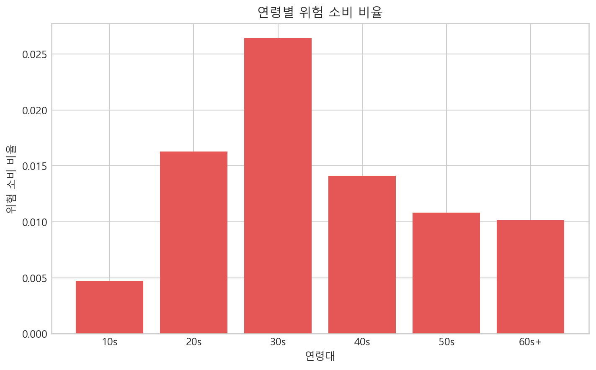
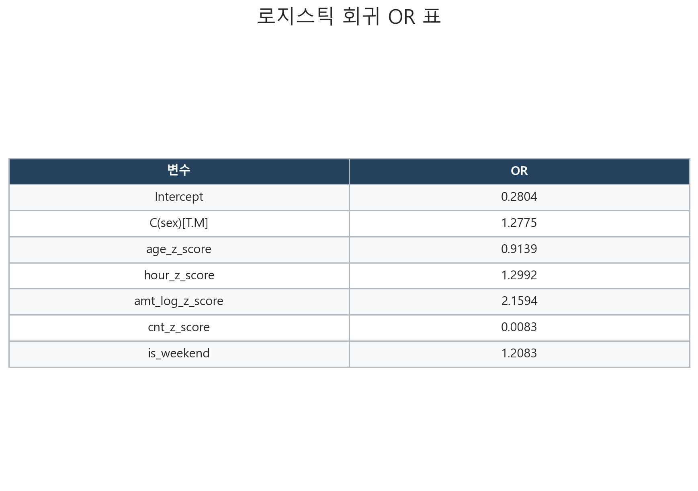
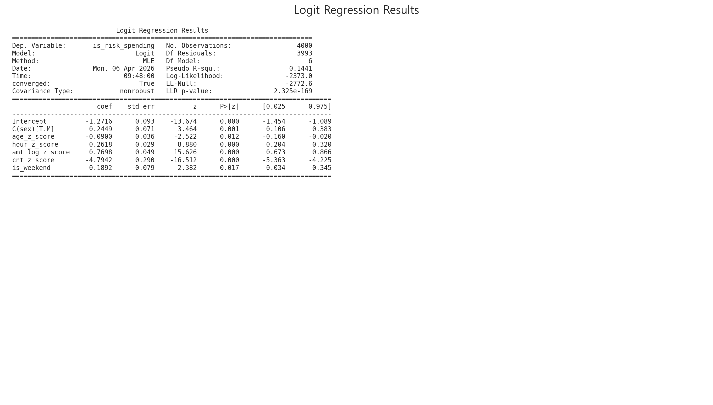

# nudgebank-ai

소비 데이터에서 금융 행동 신호를 추출해 상환 전략으로 연결하는 데이터 분석 프로젝트입니다.  
카드소비 데이터를 바탕으로 연령별 소비 차이, 소비 유형 비율, 위험 소비 특성을 분석하고, 이를 서비스 로직과 모델링 단계로 넘길 수 있는 형태로 정리했습니다.

## Overview

이 프로젝트는 단순 시각화에 머무르지 않고 아래 흐름을 하나의 파이프라인으로 묶는 데 초점을 맞췄습니다.

1. 카드소비 원본 데이터 적재
2. 연령대 그룹화와 소비유형 분류
3. ANOVA를 통한 연령별 소비 차이 검정
4. 위험 소비 비율, 필수 소비 비율, 변동성 계산
5. 로지스틱 회귀로 위험 소비 특성 확인
6. 상환 점수 및 추천 로직으로 연결

## Why This Project

- 연령별 소비 패턴이 실제로 다르게 나타나는지 통계적으로 검증했습니다.
- 업종 데이터를 금융 서비스에 활용 가능한 feature로 변환했습니다.
- 분석 결과를 표와 그래프로 정리해 보고서와 발표 자료로 바로 사용할 수 있게 만들었습니다.
- 서비스 단계에서 쓸 수 있는 점수 계산 함수까지 분리했습니다.

## Tech Stack

- Python
- pandas
- scipy
- statsmodels
- matplotlib

## Repository Structure

```text
nudgebank-ai/
├── analysis/
│   ├── __init__.py
│   └── analysis.py
├── model/
│   └── train.py
├── service/
│   └── predict.py
├── data_raw/
│   └── .gitkeep
├── docs/
│   └── assets/
├── README.md
└── .gitignore
```

## Data

원본 데이터는 Git에 포함하지 않습니다.  
팀원들은 전달받은 CSV 파일을 `data_raw/` 폴더에 넣고 실행하면 됩니다.

예시:

```bash
set NUDGEBANK_DATA_GLOB=data_raw/*.csv
python analysis/analysis.py
```

## Key Features

- `avg_spending`: 연령대별 평균 소비 금액
- `essential_ratio`: 필수 소비 비율
- `risk_ratio`: 위험 소비 비율
- `volatility`: 일별 소비 변동성
- `repayment_action`: 상환 전략 추천 결과

## Statistical Result

가설:

- `H0`: 연령대별 평균 소비 금액 차이가 없다
- `H1`: 연령대별 평균 소비 금액 차이가 있다

결과:

- `F-statistic = 4993.9786`
- `p-value < 1e-308`

해석:

연령대별 소비 금액 차이는 통계적으로 유의미했습니다.



## Key Insights

- `20대`는 재량 소비 비중이 가장 높았습니다. `26.97%`
- `30대`는 위험 소비 비율이 가장 높았습니다. `2.64%`
- `60대+`는 필수 소비 비중이 가장 높았습니다. `52.68%`
- `50대`는 소비 변동성이 가장 높았습니다.



## Summary Table

연령별 평균 소비, 소비 유형 비율, 위험 소비 비율, 변동성을 요약한 표입니다.



## Visualization

### Average Spending by Age Group



연령대가 높아질수록 평균 소비 금액이 커지는 경향이 확인되었습니다.

### Spending Type Ratio by Age Group



젊은 연령층에서는 재량 소비 비중이 상대적으로 높고, 중장년층에서는 필수 소비 비중이 더 높게 나타났습니다.

### Risk Spending Ratio by Age Group



위험 소비 비율은 30대에서 가장 높게 나타났습니다.

## Logistic Regression

위험 소비 업종 여부를 종속변수 `is_risk_spending`으로 두고 로지스틱 회귀를 수행했습니다.

주요 결과:

- `C(sex)[T.M] = 1.2633`
- `age_z_score = 0.9705`
- `hour_z_score = 1.2977`
- `amt_log_z_score = 2.0253`
- `cnt_z_score = 0.0115`
- `is_weekend = 1.2054`



회귀 결과 원문:



## Service Connection

분석 결과는 서비스 로직에서 상환 점수와 추천 전략으로 연결할 수 있습니다.

예시:

```python
score = risk_ratio * 0.5 + volatility_index * 0.3 - essential_ratio * 0.2
```

추천 규칙:

- `risk_ratio`가 높거나 `discretionary_ratio`가 높으면 `상환 강하게`
- `essential_ratio`가 높거나 `volatility_index`가 높으면 `안정형`
- 그 외에는 `기본`

## Limitations

- 현재 `risk`는 실제 연체/부실 라벨이 아니라 업종명 기반 규칙으로 정의한 대리 변수입니다.
- 로지스틱 회귀의 종속변수도 실제 금융 부실이 아니라 `위험 소비 여부`를 사용했습니다.
- 실제 상환 이력 데이터와 결합하면 더 강한 예측 모델로 확장할 수 있습니다.

## Run

분석 실행:

```bash
python analysis/analysis.py
```

모델 실행:

```bash
python model/train.py
```

서비스 예시 실행:

```bash
python service/predict.py
```

## Consumption Prediction Pipeline

```bash
python run_pipeline.py
```

## Docker

```bash
docker build -t nudgebank-ai .
docker run --env-file .env nudgebank-ai
```
